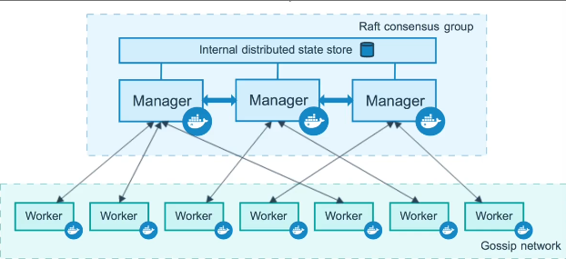

# Índice Day-6

## 1 - O meu primeiro Docker compose

O Docker Compose é uma ferramenta usada para definir e gerenciar ambientes de multi-container.

- Já vem com o Docker Desktop
    - Para instalar no Debian / Ubuntu etc: `sudo apt-get install docker-compose-plugin`

O padrão que os compose files seguem é o YML com alguns parâmetros. Portanto, vamos sar para um arquivo `yaml` criar o arquivo `docker-compose.yaml`:

```yaml
version: '3'
services:
  nginx:
    image: nginx
    ports:
      - "8080:80"
```

**Onde**
- `services` - declarar o bloco de serviços
- `nginx` - serviços
- `ports` - quais portas serão expostas (host:container)
- `image` - qual imagem será usada + a tag

*OBS*: O Docker Compose não usa mais a propriedade `version` , mas usa a versão mais recente na implementação.

**Comandos**

```bash
## Rodar
docker compose up -d

## Remover
docker compose down

## Listar o compose
docker compose ps

## Pausar os containers
docker compose pause

## Despausar os containers
docker compose unpause
```

**Onde**
- `up`: inicia todos os serviços (containers) que estão no arquivo `docker-compose.yaml`.
- `d`: Inicia os serviços em segundo plano (background).

### Referências
- [Documentação: Docker Compose](https://docs.docker.com/compose/)


## 2 - Criando e conectando mais de um container com o Compose

```yaml
version: '3'
services:
  giropops-senhas:
    image: linuxtips/giropops-senhas:1.0
    ports:
      - "5000:5000"
    networks:
      - giropops
    environment:
	    REDIS_HOST: redis
  redis:
    image: redis
    ports:
      - "6379:6379"
    networks:
      - giropops
networks:
 giropops:
   driver: bridge

```

**Onde**
- `version: '3'` - Versão do *compose* que estamos utilizando
- `services` - Início da definição de meu serviço
- `giropops-senhas` e `redis` - Nomes dos serviços
- `environment`:
    - **`networks`** - Declarando as redes que usaremos nesse *docker-compose*.
  
### Referências
- [Docker Compose - Networks](https://docs.docker.com/reference/compose-file/networks/)

## 3 - Utilizando Volumes com o Docker Compose

Campos:
- **Volumes**: onde se informa se quer persistir alguma informação ou não
- **Image**: imagem no Docker Hub

```yaml
version: '3'
services:
  giropops-senhas:
    image: linuxtips/giropops-senhas:1.0
    ports:
      - "5000:5000"
    networks:
      - giropops
    environment:
      REDIS_HOST: redis
    volumes:
      - strigus:/strigus
  redis:
    image: redis
    ports:
      - "6379:6379"
    networks:
      - giropops
    volumes:
      - strigus:/strigus
networks:
 giropops:
   driver: bridge
volumes:
  strigus:
```

### Referências
- [Docker Compose - Volumes](https://docs.docker.com/reference/compose-file/volumes/)

## 4 - Buildando uma imagem de container com o Compose e aumentando o número de réplicas

Campo **`build`**:  defininir um caminho relativo para a pasta pai do arquivo Compose. Este caminho deve ser um diretório e conter um Dockerfile.

```yaml
version: '3'
services:
  giropops-senhas:
    build: ./app/
    ports:
      - "5000:5000"
    networks:
      - giropops
    environment:
      REDIS_HOST: redis
    volumes:
      - strigus:/strigus
  redis:
    image: redis
    ports:
      - "6379:6379"
    networks:
      - giropops
    volumes:
      - strigus:/strigus
networks:
 giropops:
   driver: bridge
volumes:
  strigus:

```

**Escalando a quantidade de réplicas**

```bash
docker compose up -d --scale redis=2
```

*OBS*: Não é possível escalar serviços que tenham portas publicadas (atributo `ports`), pois não pode ter mais de um container com a mesma porta.
  
## 5 - Reservando e definindo recursos de CPU e Memória

```yaml
version: '3'
services:
  giropops-senhas:
    build: ./app/
    ports:
      - "5000:5000"
    networks:
      - giropops
    environment:
      REDIS_HOST: redis
    volumes:
      - strigus:/strigus
    depends_on:
      - redis
    deploy:
      resources:
        reservations:
          cpus: '0.25'
          memory: 128M
        limits:
          cpus: '0.5'
          memory: 256M
  redis:
    image: redis
    networks:
      - giropops
    volumes:
      - strigus:/strigus
networks:
 giropops:
   driver: bridge
volumes:
  strigus:

```

**Onde**
- `deploys`: opcional no Docker Compose, define regras de implantação para containers em diferentes ambientes.
- `resources`: define limites e reservas de recursos físicos do container.
- `reservations`: garante a alocação mínima de recursos configurados.
- `limits`: impede o uso acima dos valores definidos.
- `cpus`: limita a quantidade de CPU (núcleos) que o container pode usar.
- `memory`: limita a quantidade de memória que o container pode usar (unidades: b, k, m, g).
- `depends_on`: inicia um serviço apenas após outro estar ativo.
  
### Referências
- [Docker Compose - Resources: CPUS](https://docs.docker.com/reference/compose-file/services/#cpus)
  

## 6 - Usando healthcheck no Docker Compose

O campo `healthcheck` declara uma verificação que é executada para determinar se os contêineres de serviço estão ou não "íntegros".

```yaml
services:
  giropops-senhas:
    build: ./app/
    ports:
      - "5000:5000"
    networks:
      - giropops
    environment:
      REDIS_HOST: redis
    volumes:
      - strigus:/strigus
    depends_on:
      - redis
    deploy:
      resources:
        reservations:
          cpus: '0.25'
          memory: 128M
        limits:
          cpus: '0.5'
          memory: 256M
  redis:
    image: redis
    command: redis-server --appendonly yes
    networks:
      - giropops
    volumes:
      - strigus:/strigus
    healthcheck:
      test: ["CMD", "redis-cli", "ping"]
      interval: 30s
      timeout: 5s
      retries: 3
      start_period: 10s
networks:
 giropops:
   driver: bridge
volumes:
  strigus:
  
```

**Onde**
- `test`: comando usado para verificar a integridade do container.
- `interval`: tempo entre cada teste.
- `timeout`: tempo máximo para execução de um teste.
- `retries`: número de falhas seguidas até marcar como `unhealthy`.
- `start_period`: tempo extra para inicialização do container antes de validar.
- `start_interval`: intervalo dos testes durante o período de inicialização.
    
**OBS**: As unidades suportadas são us (microssegundos), ms (milissegundos), s (segundos), m (minutos) e h (horas).

## 7 - Docker compose [review] avançado

- Docker compose - mais atributos:

```yaml
version: '3.8'
services:
  giropops-senhas:
    build:
      context: ./app
      dockerfile: Dockerfile
    container_name: giropops-senhas-container
    ports:
      - "5000:5000"
    networks:
      - giropops
    environment:
      REDIS_HOST: redis
    env_file:
      - .env
    volumes:
      - type: volume
        source: strigus
        target: /strigus
    labels:
      dev.lu.descriptions: "Giropops Senhas App"
      dev.lu.version: "1.0"
    depends_on: 
      - redis
    deploy:
      replicas: 4
      resources:
        reservations:
          cpus: '0.25'
          memory: 128M
        limits:
          cpus: '0.5'
          memory: 256M
      update_config:
          parallelism: 2
          delay: 10s 
      restart_policy:
          condition: on-failure
          delay: 5s
          max_attemps: 3
      devices:
          - "/dev/ttyUSB0:/dev/ttyUSB0"
      dns:
        - 1.1.1.1
        - 1.0.0.1

  redis:
    image: redis
    command: redis-server --appendonly yes
    networks:
      - giropops
    volumes:
      - strigus:/strigus
    healthcheck:
      test: ["CMD", "redis-cli", "ping"]
      interval: 30s
      timeout: 5s
      retries: 3
      start_period: 10s
    labels:
      dev.lu.description: "Redis Server"
      dev.lu.version: "Latest"

networks:
  giropops:
    driver: bridge
    ipam:
      driver: default
      config:
        - subnet: "192.168.18.22/24"
      labels:
       dev.lu.network: "giropops_network"

volumes:
  strigus:
    driver: local
    driver_opts:
      type: "none"
      device: /home/ludsilva/Documentos/DevOps/PICK/Docker/Day-6
      o: "bind"
    labels:
      dev.lu.network: "strigus_volume"

```

## 8 - Docker Swarm

> *Rodar um conteiner é mole, o problema é **escalar** isso aí*

O Docker Swarm é uma ferramenta para construir *clusters* de *containers* com características importantes como balanceador de cargas e *failover*.

Basta indicar quais os *hosts* que ele irá supervisionar e o restante é com ele
- permite que os containers escalam na horizontal
 
A estrutura de *cluster* do Docker Swarm é bastante simples e se resume a um ***manager*** e diversos ***workers***.
- O *manager* é o responsável por orquestrar os *containers* e distribuí-los entre os *hosts workers*.
- Os *workers* são os que carregam o piano, ou seja, que hospedam os *containers*.

Características
- Se um node morrer, o workload é migrado
- Escala a quantidade de containers
- Gerenciamento centralizado
- Self-healing - se autocorrige
- Load Balancing
 - Rede: overlay

Hoje em dia está sendo descontinuado, não se usa em produção hein! 

**Arquitetura do Docker Swarm**



- Se perder um manager, os containers ainda ficarão acessíveis
- A stack é criada através de um Docker compose

### Exemplo

Criar 3 VMs Ubuntu em uma private network
- Uma será o manager, e as outras 2 workers

```bash
## No Manager - Usar a interface bridge - no nosso caso, é o ip da máquina
docker swarm init --advertise-addr <IP_do_host>

## Saída com token - add as 2 workers - usa a porta 2377
docker swarm join --token SWMTKN-1-66x6vod9rajdvhi9lnai5rzv4d5vnia7mq7utcomwvu76yk8rl-4a79vdv2agm8peytk67sv8iq4 <IP_do_host>:2377

## Listar os nodes - após incluir
docker node ls

## Criar service
docker service create -d --name nginx-toskao --replicas 3 -p 8080:80 nginx 

## Listar os services
docker service ls

```

**Criando a Stack**

```yaml
networks:
    my_overlay_network:
        driver: overlay
        
services:
    nginx:
        image: nginx:latest
        ports:
            - target: 80
              published: 8080
              protocol: tcp
              mode: ingress
        networks:
            - my_overlay_network
        deploy:
            replicas: 3
            update_config:
                parallelism: 2 
                delay: 10s
            resources:
                limits:
                    cpus: '0.5'
                    memory: 128M
                reservations:
                    cpus: '0.5'
                    memory: 64M
                
    mysql:
        image: mysql:latest
        ports:
            - target: 3306
              published: 3306
              protocol: tcp
              mode: host
        deploy:
            replicas: 3
            update_config:
                parallelism: 2
                delay: 10s
            resources:
                limits:
                    cpus: '0.5'
                    memory: 128M
                reservations:
                    cpus: '0.5'
                    memory: 64M
```

**Deploy da Stack**

```bash
docker stack deploy -c docker-compose.yaml toskao-services

## Fazendo demote ou promote
### Promover um node worker para manager
docker node promote [HOSTNAME]

### Tornar um manager em worker
docker node demote [HOSTNAME]
```

## Referências
- [Docker Swarm - Overview](https://docs.docker.com/engine/swarm/)

## Desafio prático
