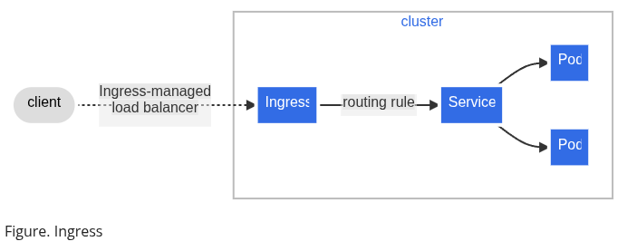
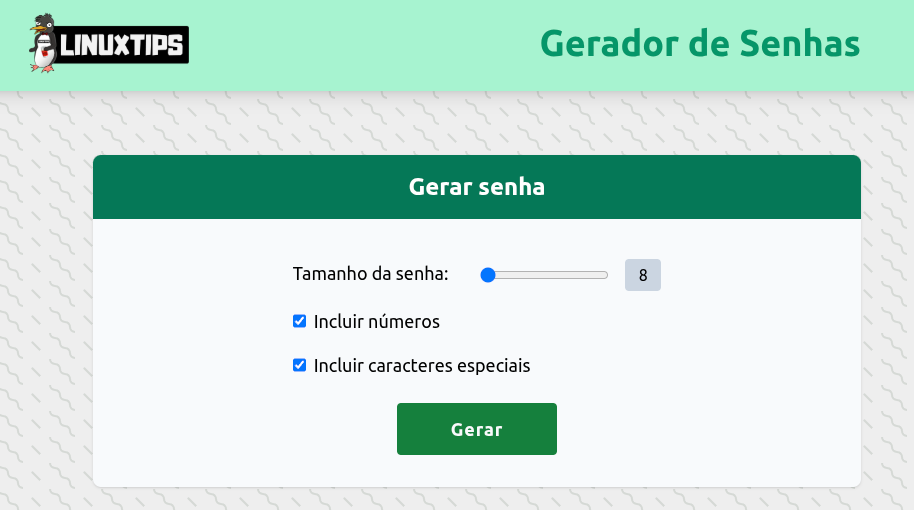
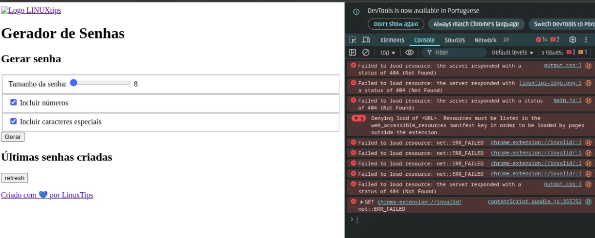
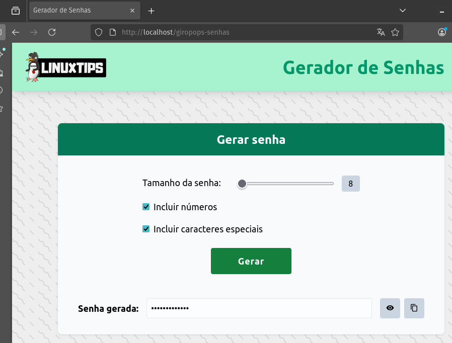
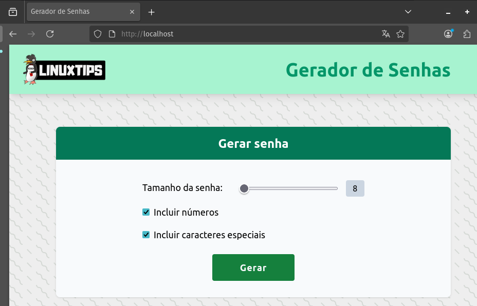
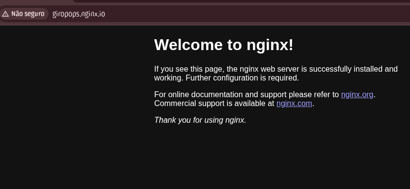
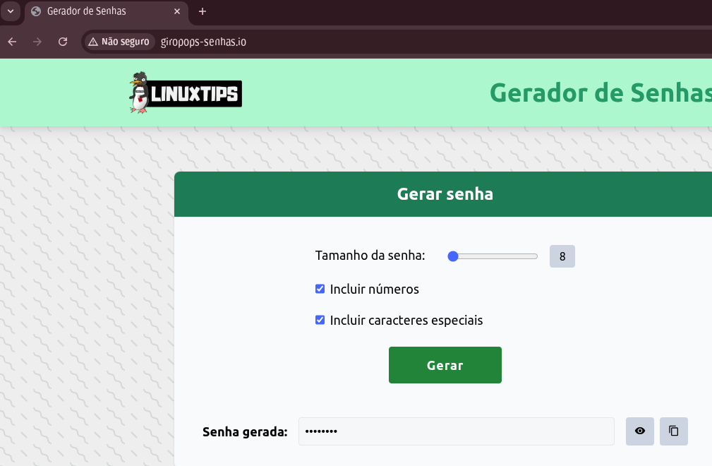
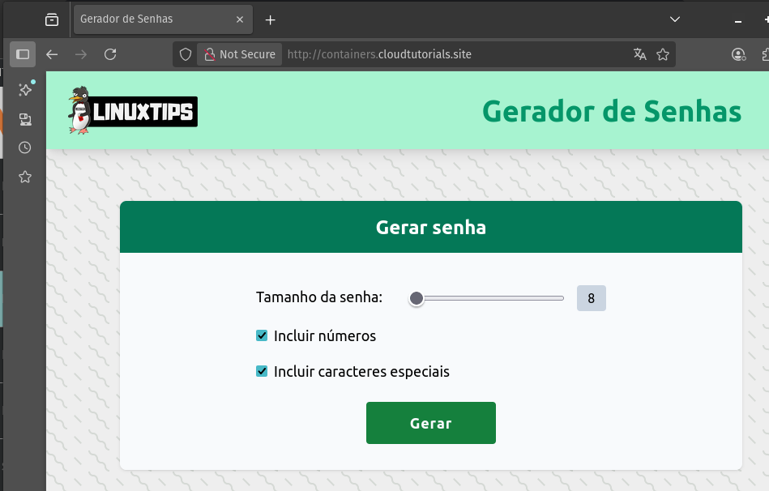

# Ìndice - Day 11

## 1 - O que é o Ingress no Kubernetes

O Ingress no Kubernetes é um recurso responsável por gerenciar o acesso externo aos serviços dentro do cluster, atuando como uma camada de roteamento HTTP/HTTPS.
Ele define regras de tráfego que direcionam requisições para os serviços internos e, com o suporte de um controlador de Ingress (como NGINX, Traefik ou Istio), oferece funcionalidades avançadas como balanceamento de carga, terminação SSL/TLS, redirecionamentos e reescrita de URLs.



**Principais Componentes e Funcionalidades:**

1. **Controlador de Ingress**: É a implementação que processa e aplica as regras definidas nos recursos Ingress. Pode ser configurado com soluções como NGINX, Traefik ou HAProxy.
2. **Regras de Roteamento**: Declaradas em um arquivo YAML, definem como as requisições externas são encaminhadas para os serviços internos.
3. **Backend Padrão**: Serviço de fallback que recebe as requisições quando nenhuma regra de roteamento é correspondida.
4. **Balanceamento de Carga**: Distribui automaticamente o tráfego entre múltiplos pods de um mesmo serviço.
5. **Terminação SSL/TLS**: Permite configurar certificados para encerrar a criptografia diretamente no ponto de entrada do cluster.
6. **Recursos Anexos**: É possível associar ConfigMaps ou Secrets para adicionar comportamentos extras, como autenticação básica, controle de acesso e parâmetros personalizados.

#### Documentação
- [Kubernetes Doc - Ingress](https://kubernetes.io/docs/concepts/services-networking/ingress/)
- [Livro: Descomplicando Kubernetes - Day 9](https://badtuxx.github.io/DescomplicandoKubernetes/pt/day-9/)

## 2 - Configurando o Kind para suportar o Ingress

Vamos criar um cluster com configurações especiais:
- Ao criar um cluster KinD, podemos especificar várias configurações que incluem mapeamentos de portas e rótulos para nós.

Para isso, crie o arquivo `kind-ingress-config.yaml`:

```yaml
kind: Cluster
apiVersion: kind.x-k8s.io/v1alpha4
nodes:
- role: control-plane
  kubeadmConfigPatches:
  - |
    kind: InitConfiguration
    nodeRegistration:
      kubeletExtraArgs:
        node-labels: "ingress-ready=true"
  extraPortMappings:
  - containerPort: 80
    hostPort: 80
    protocol: TCP
  - containerPort: 443
```

**Criar o cluster**

```bash
kind create cluster --config kind-ingress-config.yaml
```

## 3 - Instalando o Ingress Nginx Controller

Vamos instalar o Nginx Ingress Controller
- OBS:  É importante observar a versão do Ingress Controller que você está instalando, pois as versões mais recentes ou mais antigas podem não ser compatíveis com o Kubernetes que você está usando.

```bash
## Instalar
kubectl apply -f https://raw.githubusercontent.com/kubernetes/ingress-nginx/master/deploy/static/provider/kind/deploy.yaml

## Verificar se o Ingress Controller foi instalado
kubectl get pods -n ingress-nginx

## Utilizar a opção wait do kubectl, assim quando os pods estiverem prontos, ele irá liberar o shell
kubectl wait --namespace ingress-nginx \
  --for=condition=ready pod \
  --selector=app.kubernetes.io/component=controller \
  --timeout=90s

```

No comando acima, estamos esperando que os Pods do Ingress Controller estejam prontos, com o label `app.kubernetes.io/component=controller`, no namespace `ingress-nginx`. Caso não estejam prontos em 90 segundos, o comando irá falhar.

### Outras formas de instalar o Ingress Nginx Controller

**Minikube**
- Para instalar o ingress controller no Minikube, você pode usar o sistema de addons do próprio Minikube. O comando a ser executado é: `minikube addons enable ingress`

**MicroK8s**
- No caso do MicroK8s, o ingress controller também pode ser instalado via sistema de addons. O comando para isso é: `microk8s enable ingress`

**AWS (Amazon Web Services)**
- Na AWS, o ingress controller é exposto através de um Network Load Balancer (NLB). O comando para instalação é:

```bash
    kubectl apply -f https://raw.githubusercontent.com/kubernetes/ingress-nginx/controller-v1.8.2/deploy/static/provider/aws/deploy.yaml
```
    
- Você também pode configurar a terminação TLS no Load Balancer da AWS, editando o arquivo deploy.yaml com as informações do seu Certificate Manager (ACM).

**Azure**
- Na Azure, o ingress controller é instalado com o comando:
    
```bash
    kubectl apply -f https://raw.githubusercontent.com/kubernetes/ingress-nginx/controller-v1.8.2/deploy/static/provider/cloud/deploy.yaml
```
    

**GCP (Google Cloud Platform)**
- Na GCP, primeiramente certifique-se de que seu usuário tem permissões de cluster-admin. Depois, instale o ingress controller com:
    
```bash
    kubectl apply -f https://raw.githubusercontent.com/kubernetes/ingress-nginx/controller-v1.8.2/deploy/static/provider/cloud/deploy.yaml
```
    
- Você também pode precisar configurar regras de firewall se estiver usando um cluster privado.

**Bare Metal**
- Para instalações em Bare Metal ou VMs "cruas", você pode usar um NodePort para testes rápidos:
    
```bash
    kubectl apply -f https://raw.githubusercontent.com/kubernetes/ingress-nginx/controller-v1.8.2/deploy/static/provider/baremetal/deploy.yaml
```
    
- Este comando mapeará o ingress controller para uma porta no intervalo de 30000-32767.

**Digital Ocean**
- Por padrão, o objeto de serviço do controlador ingress-nginx para Digital-Ocean configura apenas uma annotation. É esta `service.beta.kubernetes.io/do-loadbalancer-enable-proxy-protocol: "true"`.
    
```bash
    kubectl apply -f https://raw.githubusercontent.com/kubernetes/ingress-nginx/controller-v1.13.2/deploy/static/provider/do/deploy.yaml
```

#### Documentação
- [Kubernetes Doc - Ingress Controllers](https://kubernetes.io/docs/concepts/services-networking/ingress-controllers/)
- [Ingress NGINX Controller](https://github.com/kubernetes/ingress-nginx)

## 3- Deploy da aplicação de exemplo

Com os seguintes arquivos, estamos criando um Deployment e um Service para o Giropops-Senhas, e um Deployment e um Service para o Redis.

**app-deployment.yaml**

```yaml
apiVersion: apps/v1
kind: Deployment
metadata:
  labels:
    app: giropops-senhas
  name: giropops-senhas
spec:
  replicas: 2
  selector:
    matchLabels:
      app: giropops-senhas
  template:
    metadata:
      labels:
        app: giropops-senhas
    spec:
      containers:
      - image: linuxtips/giropops-senhas:1.0
        name: giropops-senhas
        env:
        - name: REDIS_HOST
          value: redis-service
        ports:
        - containerPort: 5000
        imagePullPolicy: Always
```

**app-service.yaml**

```yaml
apiVersion: v1
kind: Service
metadata:
  name: giropops-senhas
  labels:
    app: giropops-senhas
spec:
  selector:
    app: giropops-senhas
  ports:
    - protocol: TCP
      port: 5000
      targetPort: 5000
      name: tcp-app
  type: ClusterIP
```

**redis-deployment.yaml**

```yaml
apiVersion: apps/v1
kind: Deployment
metadata:
  labels:
    app: redis
  name: redis-deployment
spec:
  replicas: 1
  selector:
    matchLabels:
      app: redis
  template:
    metadata:
      labels:
        app: redis
    spec:
      containers:
      - image: redis
        name: redis
        ports:
          - containerPort: 6379
        resources:
          limits:
            memory: "256Mi"
            cpu: "500m"
          requests:
            memory: "128Mi"
            cpu: "250m"
```

**redis-service.yaml**

```yaml
apiVersion: v1
kind: Service
metadata:
  name: redis-service
spec:
  selector:
    app: redis
  ports:
    - protocol: TCP
      port: 6379
      targetPort: 6379
  type: ClusterIP
```

### Deploy

```bash
## Aplicar
kubectl apply -f app-deployment.yaml
kubectl apply -f app-service.yaml
kubectl apply -f redis-deployment.yaml
kubectl apply -f redis-service.yaml

## Verificar se os pods estão rodando
kubectl get pods

## Verificar se os serviços estão rodando
kubectl get services

## Acessar a app do Giropops-Senhas
kubectl port-forward service/giropops-senhas 5000:5000
```

Acesse pelo: `http://localhost:5000`



## 4 - Criando um nossa primeira regra

Vamos criar um recurso de Ingress para expor a nossa aplicação Giropops-Senhas. Para isso, crie um arquivo chamado `ingress-1.yaml`:

```yaml
apiVersion: networking.k8s.io/v1
kind: Ingress
metadata:
  name: giropops-senhas
  annotations:
    nginx.ingress.kubernetes.io/rewrite-target: /
spec:
  rules:
  - http:
      paths:
      - path: /giropops-senhas
        pathType: Prefix
        backend:
          service: 
            name: giropops-senhas
            port:
              number: 5000
```

**Onde**
- `name`: nome do recurso Ingress.
- `annotations`: configurações extras.
  - `nginx.ingress.kubernetes.io/rewrite-target: /` → diz ao **Ingress Controller NGINX** para reescrever a URL que chega para `/` quando encaminhar para o serviço.
- `rules`: define como o tráfego deve ser roteado.
  - Nesse caso não tem `host` definido, então vale para qualquer host (inclusive `localhost`).
- `paths`: lista de caminhos que o Ingress deve escutar.
  - `path: /giropops-senhas` → qualquer requisição que comece com `/giropops-senhas`.
  - `pathType: Prefix` → corresponde a qualquer URL que **comece** com esse caminho.
- `backend`: indica para onde o tráfego vai:
  - `service.name`: `giropops-senhas` (o serviço interno no cluster).
  - `service.port.number`: `5000` (porta exposta pelo serviço).

**Comandos**

```bash
## Aplicar
kubectl apply -f ingress-1.yaml

## Ver se o ingress foi criado
kubectl get ingress

## Ver mais detalhes
kubectl describe ingress giropops-senhas
```

Aqui tanto na saída do comando `get` quanto na saída do comando `describe`, devemos ver o endereço IP do Ingress no campo `Address`.

```bash
## Você pode pegar esse IP através do comando:
kubectl get ingress giropops-senhas -o jsonpath='{.status.loadBalancer.ingress[0].hostname}'

## Caso você esteja utilizando um cluster gerenciado por algum provedor de nuvem voce pode utilizar o comando:
kubectl get ingress giropops-senhas -o jsonpath='{.status.loadBalancer.ingress[0].ip}'
```

Isso porque quando temos um cluster EKS, AKS, GCP, etc, o Ingress Controller irá criar um LoadBalancer, e o endereço IP do LoadBalancer será o endereço IP do Ingress.

- Para testar, podemos usar o comando **`curl`** com o IP, hostname ou load balancer do seu Ingress:
    - `curl ENDEREÇO_DO_INGRESS/giropops-senhas`



## O que está acontecendo com o nosso Ingress?

Os erros que estamos tomando ocorrem porque o Ingress está configurado para responder em  **/giropops-senhas**, enquanto a aplicação espera para receber as requisições em **/**. Nessecaso, a solução ideal seria ajustar o código junto ao time de desenvolvimento. Caso isso não seja possível, pode-se criar um novo Ingress usando a anotação **`nginx.ingress.kubernetes.io/rewrite-target: /`** para redirecionar corretamente.

## 5- Entendendo melhor como o Ingress funciona

Podemos "resolver" o nosso problema criando um novo recurso de Ingress, que irá encaminhar as requisições do `/static` para o `/` removendo a anotação `nginx.ingress.kubernetes.io/rewrite-target: /`

- Arquivo chamado `ingress-2.yaml`:

```yaml
apiVersion: networking.k8s.io/v1
kind: Ingress
metadata:
  name: giropops-senhas-static
  annotations:
spec:
  rules:
  - http:
      paths:
      - path: /static
        pathType: Prefix
        backend:
          service: 
            name: giropops-senhas
            port:
              number: 5000
```

**Comandos**

```bash
## Aplicar
kubectl apply -f ingress-2.yaml

## Testar
curl ENDEREÇO_DO_INGRESS/static
```



## 6 - Configurando um Ingress para a App Flask usando Redis

A aplicação está tentando se conectar ao Redis através do endereço `localhost`, e não está encontrando o Redis. Então, para resolver vamos criar um novo recurso de Ingress, indicando que o nosso `path` agora é `/` e não mais o `/giropops-senhas`.

```bash
## Listar os ingress
kubectl get ingress

## Remover os recursos
kubectl delete ingress giropops-senhas giropops-senhas-static
```

- Crie um novo arquivo chamado `ingress-3.yaml`

```yaml
apiVersion: networking.k8s.io/v1
kind: Ingress
metadata:
  name: giropops-senhas
  annotations:
    nginx.ingress.kubernetes.io/rewrite-target: /
spec:
  rules:
  - http:
      paths:
      - path: /
        pathType: Prefix
        backend:
          service: 
            name: giropops-senhas
            port:
              number: 5000
```

**Comandos**

```bash
## Aplicar
kubectl apply -f ingress-3.yaml

curl ENDEREÇO_DO_INGRESS
```



## 7 - Criando múltiplos Ingress no mesmo Ingress Controller

Como podemos rodar mais de uma aplicação no mesmo Ingress Controller?
- Vamos supor que queremos rodar a nossa aplicação do NGINX no endereço `giropops.nginx.io`, enquanto a nossa aplicação em Flask com Redis continua rodando no `localhost`.

```yaml
## Criar o nosso Pod e o nosso Service para o NGINX
kubectl run nginx --image=nginx --port=80

kubectl get pods

## Expor
kubectl expose pod nginx

kubectl get svc
```

- Crie um arquivo chamado `ingress-4.yaml`

```yaml
apiVersion: networking.k8s.io/v1
kind: Ingress
metadata:
  name: nginx
  annotations:
    nginx.ingress.kubernetes.io/rewrite-target: /
spec:
  rules:
  - host: giropops.nginx.io
	  http:
      paths:
      - path: /
        pathType: Prefix
        backend:
          service: 
            name: nginx
            port:
              number: 80
```

**Comandos**

```bash
## Aplicar
kubectl apply -f ingress-4.yaml

## Edtar o arquivo /etc/hosts para que o endereço giropops.nginx.io aponte para o endereço IP do nosso Ingress
sudo vim /etc/hosts
>> ENDEREÇO_IP_DO_INGRESS giropops.nginx.io
127.0.0.1       localhost gitlab giropops.nginx.io
::1             localhost

## Testar
> curl giropops.nginx.io
```



### Novo Ingress para a nossa aplicação em Flask com Redis

- Crie um arquivo chamado `ingress-5.yaml`

```yaml
apiVersion: networking.k8s.io/v1
kind: Ingress
metadata:
  name: giropops-senhas
  annotations:
    nginx.ingress.kubernetes.io/rewrite-target: /
spec:
  rules:
    - host: giropops-senhas.io
      http:
        paths:
          - path: /
            pathType: Prefix
            backend:
              service: 
                name: giropops-senhas
                port:
                  number: 5000
```

**Comandos**

```bash
kubectl apply -f ingress-5.yaml

## Editar o /etc
sudo vim /etc/hosts
ENDEREÇO_IP_DO_INGRESS giropops-senhas.io
```

- Alterar o /etc/hosts



## 8 - Instalando um cluster EKS para os nossos testes com Ingress

Vamos criar um cluster EKS para testar o Ingress

```bash
eksctl create cluster --name=eks-cluster --version=1.24 --region=us-east-1 --nodegroup-name=eks-cluster-nodegroup --node-type=t3.medium --nodes=2 --nodes-min=1 --nodes-max=3 --managed
```

**Versão com DigitalOcean**

```bash
doctl kubernetes cluster create giropops-ingress --region=nyc1 --node-pool=name=worker-pool;size=s-2vcpu-4gb;count=2

doctl kubernetes cluster kubeconfig save giropops-ingress
```

## 9 - Entendendo os Contexts do Kubernetes para gerenciar vários clusters

Um **contexto** no Kubernetes é um conjunto de parâmetros que determinam como interagir com um cluster Kubernetes. Isso inclui o cluster, o usuário e o namespace.

```bash
## Listar os contextos disponíveis 
kubectl config get-contexts

## Ver o contexto atual
kubectl config current-context

## Mudar o contexto
kubectl config use-context NOME_DO_CONTEXTO
```

#### Documentação
- [Kubernetes Doc - kubectl config](https://kubernetes.io/docs/reference/kubectl/generated/kubectl_config/)

## 10 - Instalando o Ingress Nginx Controller no EKS

Vamos instalar o Ingress Nginx Controller e fazer o deploy da nossa aplicação:

```bash
## Instalar na AWS
kubectl apply -f https://raw.githubusercontent.com/kubernetes/ingress-nginx/controller-v1.8.2/deploy/static/provider/aws/deploy.yaml

## Instalar na DO
kubectl apply -f https://raw.githubusercontent.com/kubernetes/ingress-nginx/controller-v1.13.2/deploy/static/provider/cloud/deploy.yaml
```

Podemos utilizar a opção `wait` do `kubectl`, assim quando os pods estiverem prontos, ele irá liberar o shell:

```bash
kubectl wait --namespace ingress-nginx \
  --for=condition=ready pod \
  --selector=app.kubernetes.io/component=controller \
  --timeout=90s
```

**Comandos**

```bash
## Ver o endereço público do LoadBalancer
kubectl get services -n ingress-nginx

## Usar os logs para verificar se o Ingress Controller está funcionando corretamente
kubectl logs -f -n ingress-nginx POD_DO_INGRESS_CONTROLLER
```

## 11 - Conhecendo o ingressClassName e configurando um novo Ingress

O **IngressClass** é um recurso do Kubernetes que especifica qual controlador de Ingress deve gerenciar um determinado recurso de Ingress. Ele é especialmente útil em ambientes com múltiplos controladores de Ingress no cluster, permitindo direcionar cada recurso para o controlador apropriado.

```bash
## Fazer o deploy da nossa aplicação
kubectl apply -f app-deployment.yaml
kubectl apply -f app-service.yaml
kubectl apply -f redis-deployment.yaml
kubectl apply -f redis-service.yaml
```

- Criar o arquivo `ingress-6.yaml`

```yaml
apiVersion: networking.k8s.io/v1
kind: Ingress
metadata:
  name: giropops-senhas
  annotations:
    nginx.ingress.kubernetes.io/rewrite-target: /
spec:
  ingressClassName: nginx
  rules:
  - http:
      paths:
      - path: /
        pathType: Prefix
        backend:
          service: 
            name: giropops-senhas
            port:
              number: 5000
```

**Aplicar**

```bash
kubectl apply -f ingress-6.yaml

kubectl get ingress
```

**Validação**


## 12 - Configurando um domínio válido para o nosso Ingress no EKS

Antes de iniciar, precisamos ter um domínio válido e configurar o subdomínio no seu provedor de DNS. Depois, precisamos de:
- Apontamento (A ou CNAME) para o IP \ endpoint - no nosso caso, com o external IP do svc LoadBalancer na DO: `kubectl get services -n ingress-nginx`
- Criar um novo recurso de Ingress com o domínio configurado
- Por fim, criar o arquivo `ingress-7.yaml`

```yaml
apiVersion: networking.k8s.io/v1
kind: Ingress
metadata:
  name: giropops-senhas
  annotations:
    nginx.ingress.kubernetes.io/rewrite-target: /
spec:
  ingressClassName: nginx
  rules:
    - host: containers.cloudtutorials.site
      http:
        paths:
          - path: /
            pathType: Prefix
            backend:
              service: 
                name: giropops-senhas
                port:
                  number: 5000
```

**Aplicar**

```bash
kubectl apply -f ingress-7.yaml
```

Veja que ele traz a aplicação somente quando a solicitação for para o subdomínio, e não para o IP diretamente:

