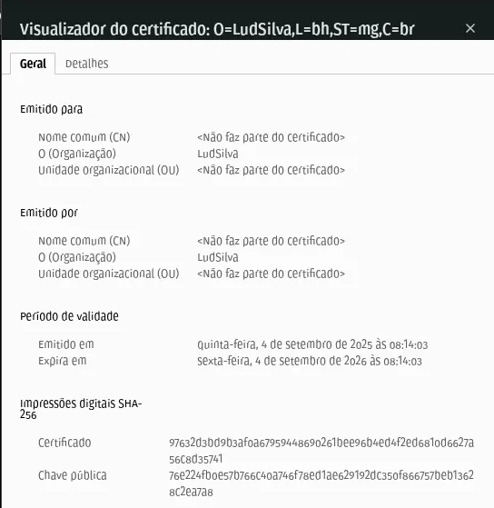

# Índice - Day 8

## 1 - O que são as Secrets do Kubernetes

Os Secrets do Kubernetes oferecem uma forma segura e flexível de gerenciar informações sensíveis, como senhas, tokens OAuth, chaves SSH e outros dados que não devem ser expostos nas configurações das aplicações.

Um Secret é um objeto que armazena pequenas quantidades de dados confidenciais — como senhas, tokens ou chaves — que podem ser consumidos por Pods ou utilizados pelo sistema para executar ações em nome deles.

**Como os Secrets funcionam**
- Os Secrets são armazenados no Etcd, o banco de dados distribuído do Kubernetes. Por padrão, eles não são criptografados, embora o Etcd ofereça suporte à criptografia para proteger os dados armazenados.
- O acesso aos Secrets é controlado pelo Role-Based Access Control (RBAC), que define quais usuários e Pods têm permissão para acessá-los.
- Os Secrets podem ser montados em Pods como arquivos em volumes ou utilizados para definir variáveis de ambiente em containers. É importante observar que, quando um Secret é atualizado, o Kubernetes não atualiza automaticamente os volumes montados ou variáveis de ambiente associadas a ele.

#### Documentação
- [Kubernetes Doc - Secrets](https://kubernetes.io/docs/concepts/configuration/secret/)
- [Livro: Descomplicando Kuberntes - Day 8](https://github.com/badtuxx/DescomplicandoKubernetes/tree/main/pt/day-8)

## 2 - Conhecendo todos os tipos de Secrets e o que é a codificação base64

**Tipos mais comuns de Secrets**
- `Opaque Secrets` - são o tipo mais simples e comum de Secret, utilizados para armazenar dados arbitrários como chaves de API, senhas e tokens. Embora sejam codificados em base64 no Kubernetes, não são criptografados. Podem ser usados para dados confidenciais, mas não são recomendados para informações altamente sensíveis, como senhas de banco de dados.
- `kubernetes.io/service-account-token` - armazenam tokens de contas de serviço, usados para autenticar Pods junto à API do Kubernetes. Esses tokens são montados automaticamente em Pods associados a uma conta de serviço.
- `kubernetes.io/dockercfg` e `kubernetes.io/dockerconfigjson` - armazenam credenciais de registro do Docker, permitindo que Pods autentiquem-se em registros privados de imagens. São montados automaticamente em Pods que utilizam essas imagens.
- `kubernetes.io/tls`, `kubernetes.io/ssh-auth` e `kubernetes.io/basic-auth` - armazenam, respectivamente, certificados TLS, chaves SSH e credenciais de autenticação básica, usados para autenticação segura entre Pods e outros serviços.
- `bootstrap.kubernetes.io/token` - armazenam tokens de inicialização usados durante o processo de autenticação de novos nós com o plano de controle do cluster Kubernetes.

*OBS: cada tipo de Secret possui um formato específico. Por exemplo, os Opaque Secrets são armazenados como mapas de strings, enquanto os TLS Secrets contêm chaves adicionais para armazenar certificados e chaves privadas.*

### O Base64

O Base64 é um método de codificação que converte dados binários em texto, permitindo o envio seguro dessas informações por canais que aceitam apenas conteúdo textual. Essa codificação garante que os dados não sejam alterados durante o transporte.
- É amplamente utilizada em diferentes contextos, como em mensagens de e-mail via MIME, no armazenamento de senhas complexas e em outras aplicações que exigem o manuseio seguro de dados.
- A codificação Base64 transforma dados binários em uma string ASCII, composta apenas por caracteres seguros para uso em URLs. Isso a torna útil para transmitir dados pela Internet de forma compatível e confiável.

⚠️ **Atenção**: Base64 não é uma forma de criptografia e não oferece confidencialidade. Seu objetivo é apenas codificar, e não proteger os dados.

Para codificar uma string em Base64 no Linux, basta usar o comando:

```bash
##Codificar
echo -n 'giropops' | base64

### Saída
>> Z2lyb3BvcHM=

### Decodificar
echo -n 'Z2lyb3BvcHM=' | base64 -d ## o parâmetro -n é usado para não add uma linha ao final da string
```

## 3 - Criando um Secret do tipo Opaque

O Secret do tipo Opaque é o tipo de Secret mais comum, sendo usado para armazenar informações arbitrárias.

Vamos criar um arquivo `giropops-secret.yaml`
- user: lud_silva
- senha: giropops

```yaml
apiVersion: v1
kind: Secret
metadata:
  name: giropops-secret
type: Opaque
data: # Inicio dos dados
  username: bHVkX3NpbHZh
  password: Z2lyb3BvcHM=
```

**Comandos**

```bash
## Aplicar
kubectl create -f giropops-secret.yaml

## Ver o secret criado
kubectl get secret giropops-secret

## Ver os dados armazenados no secret
kubectl get secret giropops-secret -o yaml

## Ver os detalhes
kubectl describe secret giropops-secret

## Criar o secret com o comando create
kubectl create secret generic giropops-secret --from-literal=username=<SEGREDO> --from-literal=password=giropops
```

Estamos usando o parâmetro `--from-literal` para definir os dados do Secret. As outras opções de parâmetros do comando são `--from-file` e `--from-env-file`, que podem ser usadas para definir os dados do Secret a partir de um arquivo ou de variáveis de ambiente.

#### Documentação
- [Kuberntes Doc - Opaque Secrets](https://kubernetes.io/docs/concepts/configuration/secret/#opaque-secrets)
- [Livro: Descomplicando Kuberntes - Day 8](https://github.com/badtuxx/DescomplicandoKubernetes/tree/main/pt/day-8)

## 4 - Utilizando o nosso Secret como variável de ambiente no Pod

Para usar o Secret em um Pod, precisamos definir o campo `spec.containers[].env[].valueFrom.secretKeyRef` no manifesto YAML do Pod.

```yaml
apiVersion: v1
kind: Pod
metadata:
  name: giropops-pod
spec:
  containers:
  - name: giropops-container
    image: nginx:1.20.1
    env: # Inicio da definição das variáveis de ambiente
    - name: USERNAME # Nome da variável de ambiente que será usada no Pod
      valueFrom: # Inicio da definição de onde o valor da variável de ambiente será buscado
        secretKeyRef: # Inicio da definição de que o valor da variável de ambiente será buscado em um Secret, através de uma chave
          name: giropops-secret # Nome do Secret que contém o valor da variável de ambiente que será usada no Pod
          key: username # Nome da chave do campo do Secret que contém o valor da variável de ambiente que será usada no Pod
    - name: PASSWORD # Nome da variável de ambiente que será usada no Pod
      valueFrom: # Inicio da definição de onde o valor da variável de ambiente será buscado
        secretKeyRef: # Inicio da definição de que o valor da variável de ambiente será buscado em um Secret, através de uma chave
          name: giropops-secret # Nome do Secret que contém o valor da variável de ambiente que será usada no Pod
          key: password # Nome da chave do campo do Secret que contém o valor da variável de ambiente que será usada no Pod
```
Explicação detalhada sobre o campo `spec.containers[].env[].valueFrom.secretKeyRef`:
- `spec.containers[].env[].valueFrom.secretKeyRef.name`: define o nome do Secret que contém o valor da variável de ambiente a ser usada pelo Pod.
- `spec.containers[].env[].valueFrom.secretKeyRef.key`: especifica a chave dentro do Secret que armazena o valor da variável de ambiente.
Dessa forma, teremos um Pod com um container chamado **giropops-container**, que define duas variáveis de ambiente — **USERNAME** e **PASSWORD** — cujos valores serão obtidos a partir do Secret **giropops-secret**.

**Comandos**

```bash
## Aplicar
kubectl apply -f giropops-pod.yaml

## Ver os pods
kubectl get pods

## Describe
kubectl describe pods giropops-pod

## Verificar se os Secrets foram injetados no Pod - comando env
kubectl exec giropops-pod -- env
```

## 5- Criando um Secret para autenticar no Docker Hub

Para que o Kubernetes possa acessar o Docker Hub, precisamos criar um Secret que armazene o nome de usuário e a senha da conta no Docker Hub. Em seguida, precisamos configurar o Kubernetes para usar esse Secret.

- Primeiro passo: pegar o conteúdo do seu arquivo `config.json` e codificar em base64, e para isso você pode usar o comando `base64`:

```bash
base64 ~/.docker/config.json

## Ou use (para não ter quebra de linhas
cat ~/.docker/config.json | base64 -w 0

```

Crie um arquivo chamado `dockerhub-secret.yaml`

```yaml
apiVersion: v1
kind: Secret
metadata:
  name: docker-hub-secret # nome do Secret
type: kubernetes.io/dockerconfigjson # tipo do Secret, neste caso é um Secret que armazena credenciais Docker
data:
  .dockerconfigjson: |  # substitua este valor pelo conteúdo do seu arquivo config.json codificado em base64
    QXF1aSB0ZW0gcXVlIGVzdGFyIG8gY29udGXDumRvIGRvIHNldSBjb25maWcuanNvbiwgY29pc2EgbGluZGEgZG8gSmVmaW0=
```

**Comandos**

```bash
kubectl apply -f dockerhub-secret.yaml

kubectl get secrets
```

**OBS:** sempre que for necessário criar um Pod que utilize uma imagem Docker privada hospedada no Docker Hub, é preciso configurar o Pod para usar o Secret que contém as credenciais de acesso. Para isso, utilize o campo `spec.imagePullSecrets` no arquivo YAML do Pod.

```yaml
apiVersion: v1
kind: Pod
metadata:
  name: meu-pod
spec:
  containers:
  - name: meu-container
    image: ludsilva/nginx-viacep:latest # campo que define o Secret que armazena as credenciais do Docker Hub
  imagePullSecrets: 
  - name: docker-hub-secret # nome do Secret
```

## 6 - Criando um Secret do tipo TLS

O Secret `kubernetes.io/tls` é utilizado para armazenar certificados TLS e chaves privadas, garantindo a segurança na comunicação entre os serviços dentro do Kubernetes. Por exemplo, ele pode ser usado para configurar HTTPS em um serviço web.

Para criar um Secret do tipo TLS, é necessário possuir um certificado TLS e uma chave privada, ambos codificados em Base64, antes de serem incluídos na criação do Secret.

- Criando um certificado autoassinado para fins de teste:

```bash
## Criar um certificado TLS e uma chave privada com o comando openssl
openssl req -x509 -nodes -days 365 -newkey rsa:2048 -keyout chave-privada.key -out certificado.crt

## Criar o Secret
kubectl create secret tls meu-servico-web-tls-secret --cert=certificado.crt --key=chave-privada.key

## Ver se foi criado
kubectl get secrets

## Ver  o conteúdo do Secret
kubectl get secret meu-servico-web-tls-secret -o yaml
```

**Atualizar o Manifesto**

```yaml
apiVersion: v1
kind: Pod
metadata:
  name: meu-pod
  labels:
    app: giropops-app
spec:
  containers:
    - name: meu-nginx
      image: ludsilva/nginx-viacep:latest
    imagePullSecrets: 
	  - name: docker-hub-secret
      ports:
        - containerPort: 80
        - containerPort: 443
      volumeMounts:
        - name: nginx-config-volume
          mountPath: /etc/nginx/nginx.conf
          subPath: nginx.conf
        - name: nginx-tls
          mountPath: /etc/nginx/tls
    volumes:
    - name: nginx-config-volume
      configMap:
        name: nginx-config
    - name: nginx-tls
      secret:
        secretName: meu-servico-web-tls-secret
        items:
          - key: tls.crt
            path: certificado.crt
          - key: tls.key
            path: chave-privada.key
```
**Onde**

- `spec.containers.volumeMounts` - monta os volumes no container.
- **nginx-config-volume** (ConfigMap) - arquivo de configuração do Nginx.
- **nginx-tls** (Secret) - certificado TLS + chave privada.
- `spec.volumes` - define os volumes usados pelo Pod.
- `volumeMounts.path` - diretório onde os arquivos ficam no container (ex.: `/etc/nginx/tls`).

## 7 - O que são ConfigMaps

Os ConfigMaps são usados para armazenar dados de configuração, como variáveis de ambiente e arquivos de configuração, permitindo que essas informações sejam reutilizadas por vários Pods.

Eles oferecem uma forma eficiente de desacoplar as configurações das imagens de container, possibilitando o uso da mesma imagem em diferentes ambientes — como desenvolvimento, teste e produção — com configurações específicas para cada um.

Alguns pontos importantes sobre o uso de ConfigMaps no Kubernetes:

- **Atualizações**: os ConfigMaps não são atualizados automaticamente nos Pods que os utilizam. Se um ConfigMap for modificado, os Pods existentes não receberão as novas configurações — é necessário recriá-los para aplicar as alterações.
- **Múltiplos ConfigMaps**: um único Pod pode usar mais de um ConfigMap, o que é útil para separar diferentes aspectos de configuração.
- **Variáveis de ambiente**: além de poderem ser montados como volumes, os ConfigMaps também podem ser usados para definir variáveis de ambiente dentro dos containers.
- **Imutabilidade**: a partir da versão 1.19 do Kubernetes, é possível tornar ConfigMaps e Secrets imutáveis, o que pode melhorar o desempenho do cluster em ambientes com um grande número desses objetos.

#### Documentação
- [Kubernetes Doc - ConfiMaps](https://kubernetes.io/docs/concepts/configuration/configmap/)
- [Livro: Descomplicando Kubernetes - Day 8](https://github.com/badtuxx/DescomplicandoKubernetes/blob/main/pt/day-8/README.md#configmaps)

## 8 - Criando um ConfigMap

Vamos criar o arquivo de configuração do Nginx chamado `nginx.conf`, que vai ser usado pelo ConfigMap:

```bash
events { } # configuração de eventos

http { # configuração do protocolo HTTP, que é o protocolo que o Nginx vai usar
  server { # configuração do servidor
    listen 80; # porta que o Nginx vai escutar
    listen 443 ssl; # porta que o Nginx vai escutar para HTTPS e passando o parâmetro ssl para habilitar o HTTPS
    
    ssl_certificate /etc/nginx/tls/certificado.crt; # caminho do certificado TLS
    ssl_certificate_key /etc/nginx/tls/chave-privada.key; # caminho da chave privada

    location / { # configuração da rota /
      return 200 'Bem-vindo ao Nginx!\n'; # retorna o código 200 e a mensagem Bem-vindo ao Nginx!
      add_header Content-Type text/plain; # adiciona o header Content-Type com o valor text/plain
    } 
  }
}
```

Onde no arquivo de configuração do Nginx estamos:
- Configurando o Nginx para escutar as portas 80 e 443, sendo que a porta 443 vai ser usada para o HTTPS.
- Configurando o Nginx para usar o certificado TLS e a chave privada que estão no diretório `/etc/nginx/tls`.
- Configurando a rota `/` para retornar o código 200 e a mensagem `Bem-vindo ao Nginx!` com o header `Content-Type` com o valor `text/plain`.
  
**Comando para criar o configmap**

```bash
kubectl create configmap nginx-config --from-file=nginx.conf
```

### Criando ConfigMap através de um manifesto

```yaml
apiVersion: v1
kind: ConfigMap
metadata:
  name: nginx-config
data:
  nginx.conf: |
    events { }

    http {
      server {
        listen 80;
        listen 443 ssl;

        ssl_certificate /etc/nginx/tls/certificado.crt;
        ssl_certificate_key /etc/nginx/tls/chave-privada.key;

        location / {
          return 200 'Olá mundo! (sim, bem clichê)\n';
          add_header Content-Type text/plain;
        }
      }
    }
```

O arquivo YAML é bem parecido com os manifestos do `Secret`, mas com algumas diferenças:

- O campo `kind` é `ConfigMap` ao invés de `Secret`.
- O campo `data` é usado para definir o conteúdo do ConfigMap, e o campo `data` é um mapa de chave-valor, onde a chave é o nome do arquivo e o valor é o conteúdo do arquivo. Usamos o caractere `|` para definir o valor do campo `data` como um bloco de texto, e assim podemos definir o conteúdo do arquivo `nginx.conf` sem a necessidade de usar o caractere `\n` para quebrar as linhas do arquivo.

```bash
## Aplicar o manifesto
kubectl apply -f nginx-config.yaml

## Ver o conteúdo do ConfigMap
kubectl get configmap nginx-config -o yaml
```

- Manifesto do pod

```yaml
apiVersion: v1
kind: Pod
metadata:
  name: nginx
  labels:
    app: nginx
spec:
  containers:
  - name: nginx
    image: nginx
    ports:
    - containerPort: 80
    - containerPort: 443
    volumeMounts:
    - name: nginx-config-volume # nome do volume que vamos usar para montar o arquivo de configuração do Nginx
      mountPath: /etc/nginx/nginx.conf # caminho onde o arquivo de configuração do Nginx vai ser montado
      subPath: nginx.conf # nome do arquivo de configuração do Nginx
    - name: nginx-tls # nome do volume que vamos usar para montar o certificado TLS e a chave privada
      mountPath: /etc/nginx/tls # caminho onde o certificado TLS e a chave privada vão ser montados
  volumes: # lista de volumes que vamos usar no Pod
  - name: nginx-config-volume # nome do volume que vamos usar para montar o arquivo de configuração do Nginx
    configMap: # tipo do volume que vamos usar
      name: nginx-config # nome do ConfigMap que vamos usar
  - name: nginx-tls # nome do volume que vamos usar para montar o certificado TLS e a chave privada
    secret: # tipo do volume que vamos usar
      secretName: meu-servico-web-tls-secret # nome do Secret que vamos usar
      items: # lista de arquivos que vamos montar, pois dentro da secret temos dois arquivos, o certificado TLS e a chave privada
        - key: tls.crt # nome do arquivo que vamos montar, nome que está no campo `data` do Secret
          path: certificado.crt # nome do arquivo que vai ser montado, nome que vai ser usado no campo `ssl_certificate` do arquivo de configuração do Nginx
        - key: tls.key # nome do arquivo que vamos montar, nome que está no campo `data` do Secret
          path: chave-privada.key # nome do arquivo que vai ser montado, nome que vai ser usado no campo `ssl_certificate_key` do arquivo de configuração do Nginx

```

**Comandos**

```bash
## Aplicar
kubectl apply -f pod-configmap.yaml

## Ver os pods
kubectl get pods

## Criar um service para expor o pod
kubectl expose pod giropops-pod

## Listar os services
kubectl get services

## Fazer o port-forward para testar se o nosso Nginx está funcionando
kubectl port-forward service/giropops-pod 4443:443

```

E *voilá*! Tudo 'funfando' corretamente, olha o certificado ai:



### Tonar o ConfigMap imutável

```yaml
apiVersion: v1
kind: ConfigMap
metadata:
  name: nginx-config
  immutable: true # torna o ConfigMap imutável
data:
  nginx.conf: |
    events { }

    http {
      server {
        listen 80;
        listen 443 ssl;

        ssl_certificate /etc/nginx/tls/certificado.crt;
        ssl_certificate_key /etc/nginx/tls/chave-privada.key;

        location / {
          return 200 'Bem-vindo ao Nginx!\n';
          add_header Content-Type text/plain;
        }
      }
    }
```

### Deixar o ConfigMap em uma namespace específica

```yaml
apiVersion: v1
kind: ConfigMap
metadata:
  name: nginx-config
  namespace: minha-namespace # deixa o ConfigMap na namespace `minha-namespace`
data:
  nginx.conf: |
    events { }

    http {
      server {
        listen 80;
        listen 443 ssl;

        ssl_certificate /etc/nginx/tls/certificado.crt;
        ssl_certificate_key /etc/nginx/tls/chave-privada.key;

        location / {
          return 200 'Bem-vindo ao Nginx!\n';
          add_header Content-Type text/plain;
        }
      }
    }
```

#### Documentação
- [Livro: Descomplicando Kubernetes - Day 8](https://github.com/badtuxx/DescomplicandoKubernetes/tree/main/pt/day-8#configmaps)
- [Nginx Doc - Configuration File's Structure](https://nginx.org/en/docs/beginners_guide.html#conf_structure)