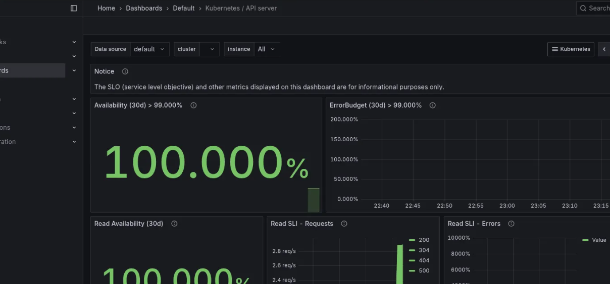
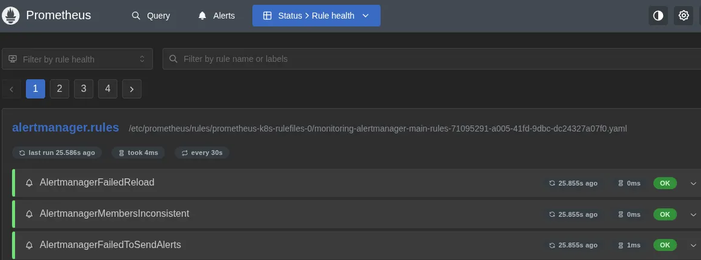
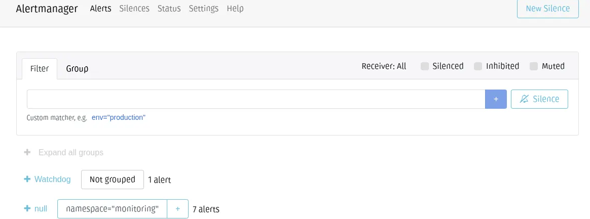

# Índice - Day 9

## 1 - O que é o Prometheus Operator e o Kube-Prometheus

O Prometheus é uma ferramenta open source de monitoramento e alerta que coleta e armazena métricas em séries temporais. Ele possibilita consultas e a criação de alertas em tempo real, oferecendo uma visão detalhada do desempenho e da saúde dos sistemas.

O kube-prometheus é um conjunto de manifestos para Kubernetes que facilita a implantação e configuração de uma stack completa de monitoramento, incluindo Prometheus Operator, Grafana, AlertManager, Node Exporter, Kube-State-Metrics e Prometheus-Adapter, garantindo alta disponibilidade e integração entre os componentes.
- Com ele, é possível monitorar todos os principais componentes do cluster Kubernetes, como kube-scheduler, kube-controller-manager, kubelet, kube-proxy, entre outros.

#### Documentação
- [Prometheus Operator e Kube-Prometheus](https://github.com/prometheus-operator/kube-prometheus)

## 2- Instalando o EKSCTL e o AWS CLI

- O EKS é um Kubernetes gerenciado da AWS:
    - Não precisamos cuidar do control plane
    - Só nos preocupamos com os workers

Para usar o EKS da AWS, também usaremos a ferramenta `eksctl`

```bash
## Instalar o eksclt
curl --silent --location "https://github.com/weaveworks/eksctl/releases/latest/download/eksctl_$(uname -s)_amd64.tar.gz" | tar xz -C /tmp
sudo mv /tmp/eksctl /usr/local/bin

## Instalar a AWS CLI
curl "https://awscli.amazonaws.com/awscli-exe-linux-x86_64.zip" -o "awscliv2.zip"
unzip awscliv2.zip
sudo ./aws/install

## Configurar as credenciais de acesso da AWS
aws configure

## Criar o cluster EKS
eksctl create cluster --name=eks-cluster --version=1.24 --region=us-east-1 --nodegroup-name=eks-cluster-nodegroup --node-type=t3.medium --nodes=2 --nodes-min=1 --nodes-max=3 --managed

## Instalar o Kubectl localmente
curl -LO "https://dl.k8s.io/release/$(curl -L -s https://dl.k8s.io/release/stable.txt)/bin/linux/amd64/kubectl"
chmod +x ./kubectl
sudo mv ./kubectl /usr/local/bin/kubectl

## Configurar o kubectl para usar o cluster EKS
aws eks --region us-east-1 update-kubeconfig --name eks-cluster

## Ver se está funcionando corretamente
kubectl get nodes

```

**Comandos e o `eksctl`**

```bash
## Listar os clusters na conta
eksctl get cluster -A

## Listar os clusters de uma região
eksctl get cluster -r us-east-1

##Aumentar o número de nós do cluster
eksctl scale nodegroup --cluster=eks-cluster --nodes=3 --nodes-min=1 --nodes-max=3 --name=eks-cluster-nodegroup -r us-east-1

## Diminuir o número de nós
eksctl scale nodegroup --cluster=eks-cluster --nodes=1 --nodes-min=1 --nodes-max=3 --name=eks-cluster-nodegroup -r us-east-1

## Deletar o cluster
eksctl delete cluster --name=eks-cluster -r us-east-1
```

#### Documentação
- [EKSCTL](https://eksctl.io/)
- [AWS CLI](https://aws.amazon.com/pt/cli/)

### Instalando na Digital Ocean

Por motivos didáticos (e monetários), vamos usar a DigitalOcean para criar o cluster, pois ao criar uma conta nova, você ganha [$200 em créditos para usar em 60 dias](https://m.do.co/c/257fe357b240) - ou por 1 ano, caso você seja estudante e se inscreva no [GitHub Student Pack](https://education.github.com/pack).

O DOKS (DigitalOcean Kubernetes Service) é o serviço gerenciado de Kubernetes da DigitalOcean, que facilita a implantação, gerenciamento e escalabilidade de clusters Kubernetes na infraestrutura da DigitalOcean.

E o `doctl` é a ferramenta de linha de comando oficial da DigitalOcean, que permite gerenciar recursos e serviços da DigitalOcean diretamente do terminal.

**Configurar as ferramentas**

```bash
## Instalar doclt
### Fazer o download da versão mais recente
cd ~
wget https://github.com/digitalocean/doctl/releases/download/v1.141.0/doctl-1.141.0-linux-amd64.tar.gz

### Extrair o binário
tar xf ~/doctl-1.141.0-linux-amd64.tar.gz

### Mover o binário para executar
sudo mv ~/doctl /usr/local/bin

## Usar a token de API para acessar a conta
doctl auth init --context <NAME>

## Alternar entre os contextos de autenticação
doctl auth list
doctl auth switch --context <NAME>

## Validar se o doctl está funcionando
doctl account get

## Ver os sizes disponíveis
doctl kubernetes options sizes

## Criar o cluster
doctl k8s cluster create <nome-do-cluster> --region nyc1 --version 1.33.1-do.3 --node-pool "name=default-pool;size=s-2vcpu-4gb;count=2" --tag k8s-test

## Salvar o arquivo kubeconfig
doctl k8s cluster kubeconfig save <nome-do-cluster>

## Testar
kubectl get nodes

```

**Mais comandos do `doctl`**

```bash
## Listar os clusters
doctl k8s cluster list

## Aumentar o número de nodes
doctl k8s cluster node-pool update <nome-do-cluster> <nome-do-node-pool> --count <novo-numero-de-nós>

## Diminuir a quantidade de nodes
doctl k8s cluster node-pool update meu-cluster --name default-pool --count 1

## Deletar o cluster
doctl k8s cluster delete <nome-do-cluster>

## Deletar tudo mesmo
doctl k8s cluster delete <nome-do-cluster> --dangerous
```

Pode ocorrer da DigitalOcean não apagar todos os recursos. É raro, mas é melhor não arriscar, não é? Então, para garantir:

```bash
# Listar Droplets
doctl compute droplet list

# Deletar Droplet específico (substitua pelo ID ou nome)
doctl compute droplet delete <ID>

## Listar outros recursos
doctl compute volume list
doctl compute load-balancer list
doctl compute firewall list
```

#### Documentação
- [DigitalOcean - doctl](https://docs.digitalocean.com/reference/doctl/)
- [DigitalOcean - DOKS](https://docs.digitalocean.com/products/kubernetes/)

## 3 - Instalando o Kube-Prometheus

- Instalar o Kube-Prometheus:

```bash

git clone https://github.com/prometheus-operator/kube-prometheus
cd kube-prometheus
kubectl create -f manifests/setup

## Verificar se a instalação dos CRDs
kubectl get servicemonitors -A

## Instalar o Prometheus e o Alertmanager
kubectl apply -f manifests/

## Verificar se a instalação foi concluída
kubectl get pods -n monitoring
```

## 4 - Acessando o nosso Grafana

- Fazer o `port-forward` para acessar o Grafana:

```bash
kubectl port-forward -n monitoring svc/grafana 33000:3000

http://localhost:33000
```

**Exemplo dos dashs**



O **Kube-Prometheus** cria vários **dashboards** no Grafana, cobrindo:
- **API Server e componentes do Kubernetes** (Node, Pod, Deployment etc.).
- **Cluster**: consumo de CPU e memória em diferentes níveis:
  - **Cluster** (todos os nós).
  - **Namespaces (Pods)**.
  - **Namespaces (Workloads)** – deployments, statefulsets e daemonsets.
  - **Node** (por nó).
  - **Pod (Containers)** – por container.

Ou seja, ele fornece visibilidade completa do uso de recursos e performance em diferentes camadas do Kubernetes.

## 5 - Acesssando o nosso Prometheus e o Alertmanager

- Acessar da mesma forma, acessando port-forward:

```bash
## Prometheus
kubectl port-forward -n monitoring svc/prometheus-k8s 39090:9090

## Alertmanager
kubectl port-forward -n monitoring svc/alertmanager-main 39093:9093

```

**Prometheus**



**AlertManager**



## 6 - O que é um ServiceMonitor?

O ServiceMonitor é um recurso do Prometheus Operator que define como o Prometheus deve coletar métricas de um serviço específico. Para monitorar um serviço, é necessário criar um ServiceMonitor correspondente, especificando os endpoints e parâmetros de coleta.
- Existem diferentes formas de configurar e personalizar a forma como o monitoramento é realizado.

O kube-prometheus já inclui diversos ServiceMonitors pré-configurados, como os do API Server, Node Exporter, Blackbox Exporter, entre outros, facilitando a monitoração dos principais componentes do cluster Kubernetes.

```bash
## Ver os servicemonitores na namespace monitoring
kubectl get servicemonitors -n monitoring

## Ver o conteúdo de um ServiceMonitor
kubectl get servicemonitor prometheus-k8s -n monitoring -o yaml

kubectl get servicemonitor grafana -n monitoring -o yaml
```

**Arquivo yaml**

```yaml
apiVersion: monitoring.coreos.com/v1
kind: ServiceMonitor
metadata:
  annotations:
  labels:
    app.kubernetes.io/component: prometheus
    app.kubernetes.io/instance: k8s
    app.kubernetes.io/name: prometheus
    app.kubernetes.io/part-of: kube-prometheus
    app.kubernetes.io/version: 2.41.0
  name: prometheus-k8s
  namespace: monitoring
spec:
  endpoints:
  - interval: 30s
    port: web
  - interval: 30s
    port: reloader-web
  selector:
    matchLabels:
      app.kubernetes.io/component: prometheus
      app.kubernetes.io/instance: k8s
      app.kubernetes.io/name: prometheus
      app.kubernetes.io/part-of: kube-prometheus
```

**Onde**
- `apiVersion`: Versão da API do Kubernetes que estamos utilizando.
- `kind`: Tipo de objeto que estamos criando.
  - `metadata`: Informações sobre o objeto que estamos criando.
    - `metadata.annotations`: Anotações que podemos adicionar ao nosso objeto.
    - `metadata.labels`: Labels que podemos adicionar ao nosso objeto.
    - `metadata.name`: Nome do nosso objeto.
    - `metadata.namespace`: Namespace onde o nosso objeto será criado.
  - `spec`: Especificações do nosso objeto.
    - `spec.endpoints`: Endpoints que o nosso ServiceMonitor irá monitorar.
    - `spec.endpoints.interval`: Intervalo de tempo que o Prometheus irá fazer a coleta de métricas.
    - `spec.endpoints.port`: Porta que o Prometheus irá utilizar para coletar as métricas.
    - `spec.selector`: Selector que o ServiceMonitor irá utilizar para encontrar os serviços que ele irá monitorar.
