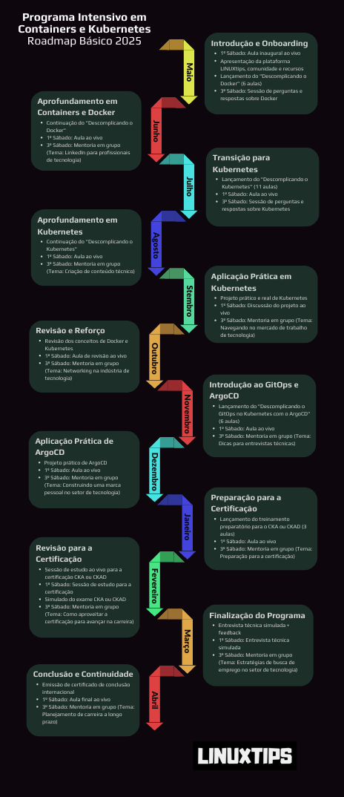

# Programa Intensivo em Containers e Kubernetes 2025
Repositório para centralizar as anotações, arquivos, estudos e desafios do PICK 25 da [LinuxTips](https://linuxtips.io/)

## Descomplicando o Docker
- [Day 1](./Docker/Day1/Day-1.md)
- [Day 2](./Docker/Day2/Day-2.md)
- [Day 3](./Docker/Day3/Day-3.md)
- [Day 4](./Docker/Day4/Day-4.md)

### Roadmap

